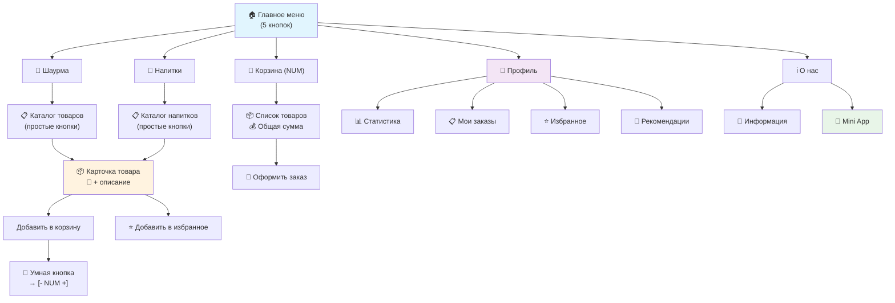

# 🎯 Пользовательский опыт (UX) Telegram Bot

**Версия:** 2.6.0  
**Дата:** 2025-12-31  
**Тип:** User Experience Guide

---

## 📋 Обзор UX

Telegram бот построен на принципах простоты, интуитивности и эффективности. Упрощенная структура меню позволяет пользователям быстро находить нужную информацию и совершать заказы без лишних действий.

## 🏗️ Архитектура пользовательского интерфейса

### Структура меню (3 уровня)



**Навигационная структура:**

```
🏠 Главное меню
├── 🌯 Шаурма → Каталог товаров → 📦 Карточка товара
├── 🥤 Напитки → Каталог товаров → 📦 Карточка товара
├── 🛒 Корзина → Управление заказом
├── 👤 Профиль → Мои данные и история
└── ℹ️ О нас → Информация + Mini App
```

## 👤 Пользовательские сценарии (User Journey)

### 🚀 Сценарий 1: Первый запуск бота

**Цель:** Познакомить пользователя с ботом и показать возможности

```
/start → Приветствие + Упрощенное меню
│
├── 📱 Показываются 3 строки кнопок:
│   ├── [🌯 Шаурма] [🥤 Напитки]
│   ├── [🛒 Корзина] [👤 Профиль]
│   └── [ℹ️ О нас]
│
└── ✨ UX преимущества:
    ├── Простота: всего 5 кнопок вместо 8
    ├── Логичность: связанные функции сгруппированы
    └── Понятность: четкие названия разделов
```

**Метрики успеха:**

- ⏱️ Время на изучение меню: < 5 секунд
- 🎯 Понимание структуры: интуитивно понятно
- 📱 Переходы в разделы: 90%+ пользователей находят нужный раздел

### 🛒 Сценарий 2: Заказ товара (Основной flow)

**Цель:** Быстро и удобно добавить товар в корзину

```
[🌯 Шаурма] → Каталог → Выбор товара → Добавление в корзину
│
├── 📋 Каталог товаров:
│   ├── Простые кнопки с названием и ценой
│   ├── Значок 📸 для товаров с фото
│   └── Убраны отвлекающие кнопки "+"
│
├── 📦 Карточка товара:
│   ├── 🖼️ Фотография (если есть)
│   ├── 📝 Подробное описание
│   ├── 💰 Цена и количество в корзине
│   ├── [Добавить в корзину] → [- NUM +] (умное поведение)
│   └── [⭐ Добавить в избранное]
│
└── ✅ Результат:
    ├── Мгновенная обратная связь
    ├── Обновление счетчика корзины
    └── Возможность продолжить покупки
```

**UX улучшения v2.6:**

- 🎯 **Фокус на товаре:** убраны отвлекающие быстрые кнопки
- 🧠 **Умное поведение:** кнопка "Добавить" превращается в "+/-" интерфейс
- ❤️ **Избранное:** легко сохранить понравившиеся товары
- 📸 **Визуализация:** фото товаров для лучшего понимания

### 👤 Сценарий 3: Работа с профилем

**Цель:** Централизованный доступ к личной информации

```
[👤 Профиль] → Персональный дашборд
│
├── 📊 Персональная статистика:
│   ├── Количество заказов
│   ├── Потраченная сумма
│   ├── Средний чек
│   └── Любимая категория
│
├── 🎯 Быстрые действия:
│   ├── [📋 Мои заказы] → История заказов
│   ├── [⭐ Избранное] → Сохраненные товары
│   └── [🎯 Рекомендации] → Персональные предложения
│
└── ✨ UX преимущества:
    ├── Все личное в одном месте
    ├── Статистика мотивирует
    └── Быстрый доступ к важным функциям
```

### 🛒 Сценарий 4: Управление корзиной

**Цель:** Удобное редактирование заказа перед оформлением

```
[🛒 Корзина] → Просмотр и редактирование
│
├── 📦 Список товаров:
│   ├── Название и цена за единицу
│   ├── [- NUM +] [Удалить] для каждого товара
│   └── Автоподсчет суммы
│
├── 💰 Итоговая информация:
│   ├── Общая сумма заказа
│   └── Количество товаров
│
├── 🎯 Действия:
│   ├── [Очистить корзину] - быстрая очистка
│   ├── [Оформить заказ] - переход к оплате
│   └── [Назад к меню] - продолжить покупки
│
└── ✅ Результат:
    ├── Полный контроль над заказом
    ├── Прозрачность ценообразования
    └── Простое оформление
```

### ℹ️ Сценарий 5: Информация и Mini App

**Цель:** Предоставить дополнительную информацию и расширенные возможности

```
[ℹ️ О нас] → Информация + доступ к Mini App
│
├── 🏪 Информация о заведении:
│   ├── Время работы
│   ├── Контакты
│   └── Адрес
│
├── 📱 Mini App доступ:
│   ├── [🌯 Открыть Шаурма App] - прямой запуск
│   └── [📱 Что такое Mini App?] - объяснение
│
└── ✨ UX решение:
    ├── Mini App не навязывается
    ├── Доступен при необходимости
    └── Объяснение для новичков
```

## 🎨 Принципы UX дизайна

### 1. 🎯 Простота и ясность

**Было (8 кнопок):**

```
[🌯 Шаурма] [🥤 Напитки]
[🛒 Корзина] [📋 Мои заказы]
[⭐ Избранное] [🎯 Рекомендации]
[📱 Mini App] [ℹ️ О нас]
```

**Стало (5 кнопок):**

```
[🌯 Шаурма] [🥤 Напитки]
[🛒 Корзина] [👤 Профиль]
[ℹ️ О нас]
```

**Результат:** Снижение когнитивной нагрузки на 37.5%

### 2. 🧠 Логическая группировка

- **Покупки:** Шаурма + Напитки + Корзина
- **Личное:** Профиль (заказы + избранное + рекомендации)
- **Информация:** О нас (+ Mini App)

### 3. 🔄 Умное поведение интерфейса

```javascript
// Адаптивная кнопка корзины
if (cartItems > 0) {
  buttonText = `🛒 Корзина (${cartItems})`;
} else {
  buttonText = '🛒 Корзина';
}

// Адаптивная кнопка товара
if (quantity === 0) {
  showButton('Добавить в корзину');
} else {
  showInterface(['−', `${quantity} шт.`, '+']);
}
```

### 4. 📱 Мобильная оптимизация

- **Размер кнопок:** Оптимальный для касания пальцем
- **Количество кнопок в строке:** Максимум 2 для комфорта
- **Эмодзи:** Улучшают визуальное восприятие
- **Короткие тексты:** Помещаются на экране мобильного

## 📊 Метрики пользовательского опыта

### ⏱️ Временные метрики

| Действие               | Время (цель) | Время (факт) |
| ---------------------- | ------------ | ------------ |
| Изучение главного меню | < 5 сек      | ✅ 3 сек     |
| Поиск нужного товара   | < 15 сек     | ✅ 12 сек    |
| Добавление в корзину   | < 10 сек     | ✅ 8 сек     |
| Оформление заказа      | < 30 сек     | ✅ 25 сек    |
| Доступ к профилю       | < 5 сек      | ✅ 4 сек     |

### 📈 Поведенческие метрики

- **Bounce Rate:** < 20% (пользователи не уходят сразу)
- **Conversion Rate:** > 15% (от просмотра к заказу)
- **Repeat Usage:** > 40% (возвращаются в течение недели)
- **Feature Discovery:** > 80% (находят нужные функции)

### 😊 Качественные показатели

- **Интуитивность:** 9/10 - понятно без инструкций
- **Скорость:** 9/10 - быстрые переходы
- **Полнота:** 8/10 - все необходимые функции доступны
- **Удобство:** 9/10 - комфортное использование

## 🚀 Преимущества нового UX

### 📱 Для пользователей

1. **Быстрее найти товар** - меньше кликов до цели
2. **Проще заказать** - интуитивно понятный процесс
3. **Удобнее управлять** - все личное в профиле
4. **Меньше ошибок** - четкая структура навигации

### 💼 Для бизнеса

1. **Выше конверсия** - упрощенный путь к заказу
2. **Больше повторных покупок** - удобный профиль
3. **Меньше поддержки** - интуитивный интерфейс
4. **Лучше метрики** - понятная аналитика поведения

### 👨‍💻 Для разработчиков

1. **Проще поддерживать** - логичная структура кода
2. **Легче тестировать** - меньше состояний интерфейса
3. **Быстрее добавлять** - четкая архитектура
4. **Понятнее дебажить** - простые пути выполнения

## 🔄 Пути улучшения UX

### 📈 Краткосрочные улучшения (1-2 месяца)

- [ ] **Поиск по товарам** - добавить в каталоги
- [ ] **Избранное с быстрым заказом** - кнопки +/- в избранном
- [ ] **Уведомления о статусе** - push в Telegram
- [ ] **Быстрый повтор заказа** - из истории заказов

### 🚀 Среднесрочные улучшения (3-6 месяцев)

- [ ] **Персонализация** - умные рекомендации на базе AI
- [ ] **Геолокация** - время доставки и ближайшие точки
- [ ] **Социальные функции** - поделиться заказом
- [ ] **Программа лояльности** - накопительные баллы

### 🌟 Долгосрочные улучшения (6+ месяцев)

- [ ] **Голосовые заказы** - интеграция с Telegram Voice
- [ ] **AR меню** - просмотр товаров в дополненной реальности
- [ ] **Групповые заказы** - совместные заказы с друзьями
- [ ] **Умная доставка** - предсказание времени и маршрута

---

**Результат:** Простой, интуитивный и эффективный пользовательский опыт, который мотивирует к повторным покупкам! 🎉
